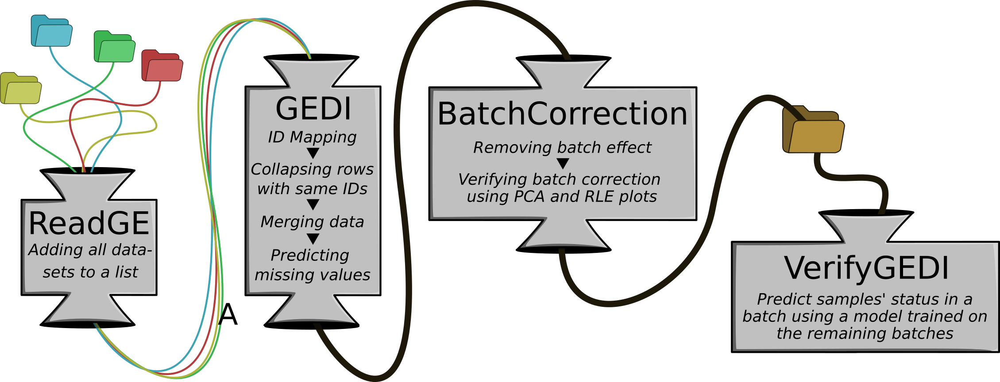

<!-- README.md is generated from README.Rmd. Please edit that file -->

# GEDI

<!-- badges: start -->
<!-- badges: end -->

The aim of GEDI (Gene Expression Data Integration) is to make it easier
and more straightforward to write transcriptomic data integration
pipelines using only four functions.

## Authors

-   [Mathias N. Stokholm](https://github.com/MNStokholm)
    (<MNStokholm@gmail.com>)
-   Maria B. Rabaglino
-   Haja N. Kadarmideen (<hajak@dtu.dk>)

## Installation

You can install the released version of GEDI from
[GitHub](https://www.github.com/MNStokholm/GEDI) with:

``` r
library(devtools)

# Use devtools to install GEDI from github
github_install("MNStokholm/GEDI")
```

## Usage

GEDI can be used to create a transcriptomic data integration pipeline
that reads, re-annotates and merges the datasets after which the batch
effect is removed. Unsupervised and supervised machine learning methods
ensure that the batch correction and data integration was successful.
The pipeline is visually represented by the figure below.



The GEDI package saves time for the user by partially automating
transcriptomic data integration and making writing a pipeline
straightforward using only four functions; `ReadGE()`, `GEDI()`,
`BatchCorrection()` and `VerifyGEDI()`. The `ReadGE()` function reads
all the gene expression datasets and stores them in a list. It can read
data from RNA sequencing and Affymetrix- and Agilent microarrays. The
`GEDI()` function maps reporter IDs to Ensembl gene IDs using the
*biomaRt* package and integrates the datasets into one data table. Here,
reporter IDs refer to both probe IDs in microarray data and read IDs in
RNA-seq data. Reporter IDs covered by the *biomaRt* package have a
corresponding BioMart attribute. All attributes can be found using the
`BM_attributes()` function. The `BatchCorrection()` function removes the
batch effect from the integrated dataset. The BatchCorrection function
verifies itself by calculating and printing the mean and standard
deviations of the gene expressions for each batch before and after the
batch correction. If the means of the batches are similar, then the
batch effect has been removed. Optionally, the verification can be
supported visually with a before/after comparison of Principal Component
Analysis (PCA) plots and RLE plots. A PCA plot is constructed to check
if the data aggregates in batches, and an RLE plot is used to show the
distribution of the data. Finally, the `VerifyGEDI()` function verifies
the transcriptomic data integration using one of two classifiers to
predict the samples’ status in one batch based on the remaining batches’
samples. Here, a sample’s status refers to a variable that describes,
e.g. if the sample is sick or healthy. The status variable does not have
to be binary.

## Setting up the data

### Gene Expression Datasets

All the datasets must be located in the same directory to read the gene
expression datasets with the `ReadGE()` function.

A subdirectory for each dataset contains the data files. The
subdirectories’ content depends on whether the dataset in question
contains Affymetrix, Agilent or RNA sequencing data (summarised in the
table below). In Affymetrix datasets, a .CEL or .CEL.gz file represents
an individual sample. In Agilent datasets, the GEDI package assumes all
.txt or .txt.gz files to represent a sample. The filenames `"annot.txt"`
and `"targets.txt"` are exceptions to this rule. The GEDI package does
not use `"targets.txt"`, and `"annot.txt"` is an annotation file
described later in this section. In RNA sequencing datasets, a file
called `"RawCounts.txt"` contains a table of raw counts where each
column is a sample. The GEDI package transforms the counts when reading
the data, so `"RawCounts.txt"` should not contain transformed or
normalised RNA-seq data.

| Data type  | Filenames        | Description              |
|:-----------|:-----------------|:-------------------------|
| Affymetrix | .CEL and .CEL.gz | One file for each sample |
| Agilent    | .txt and .txt.gz | One file for each sample |
| RNA-seq    | “RawCounts.txt”  | Each column is a sample  |

### Annotation tables

One of the steps in transcriptomic data integration is to map all
reporter IDs to Ensembl gene IDs, which the `GEDI()` function does. If a
dataset contains reporter IDs not covered by the *biomaRt* package , the
`GEDI()` function uses an annotation table to map the reporter IDs. A
missing or invalid annotation table results in skipping the dataset in
question. The annotation table is a tab-separated file called
`"annot.txt"`. This file should be in the same subdirectory as the
corresponding data files.

The annotation table in the `"annot.txt"` file contains two columns; see
the table below. The first column contains the reporter IDs used as row
names in the dataset. The second column contains the corresponding
Ensembl gene IDs or another type of reporter ID with a BioMart
attribute. The second column’s name must correspond to the BioMart
attribute, e.g. `"ensembl_gene_id"`. All valid BioMart attributes can be
found using the `BM_attributes()` function.

| ID             | ensembl\_gene\_id  |
|:---------------|:-------------------|
| A\_73\_112733  | ENSBTAG00000000005 |
| A\_73\_109892  | ENSBTAG00000000008 |
| A\_73\_P066806 | ENSBTAG00000000009 |
| A\_73\_113020  | ENSBTAG00000000010 |
| …              | …                  |

## Example pipeline

This section presents an example pipeline that demonstrate how to use
the GEDI package. Three datasets will be integrated; A RNA-sequencing
dataset, an Affymetrix dataset and an Agilent dataset. This data used
can be seen in `"man/examples"` in the GitHub repository of the GEDI
package. The datasets are intentionally very small for the sake of a
quick example.

The first step is to read the datasets. This is done with the `ReadGE()`
function.

``` r
library(GEDI)
#> 
# Names of folders with data
dataFolders <- c("RNAseq_data", "affy_data", "agilent_data")
# Which type of data is each dataset
sources <- c("RNAseq", "affy", "agilent")

# Read the data
PATH_TO_DATA_FOLDERS <- "man/examples"
datasets <- ReadGE(dataFolders, sources, path = PATH_TO_DATA_FOLDERS)
#> Reading RNAseq_data...
#> Reading affy_data...
#> Reading agilent_data...
```

Next, the three datasets are integrated with the `GEDI()` function. In
this example, the datasets are re-annotated using annotation tables
instead of BioMart. These annotation tables can be found in the relevant
data folders.

The GEDI function requires BioMart attributes for each dataset as input.
The RNA-sequencing dataset is already annotated with Ensembl gene IDs,
therefore it should not be re-annotated and the attribute is
`"ensembl_gene_id"`. The BioMart attribute for the Affymetrix dataset is
`"affy_bovine"`, but there are no attribute for the agilent dataset.

``` r
attr <- c("ensembl_gene_id", "affy_bovine", NA)
```

In order to map the agilent IDs to Ensembl gene IDs, an annotation table
is needed:

| ID             | ensembl\_gene\_id  |
|:---------------|:-------------------|
| A\_73\_112733  | ENSBTAG00000000005 |
| A\_73\_109892  | ENSBTAG00000000008 |
| A\_73\_P066806 | ENSBTAG00000000009 |
| A\_73\_113020  | ENSBTAG00000000010 |
| …              | …                  |

This table is located in the `"agilent_data"` folder. Now the datasets
can be integrated.

``` r
# The datasets are integrated. The species Bos taurus is used
dat <- GEDI(datasets, attributes = attr, BioMart = TRUE,
            species = "btaurus", path = PATH_TO_DATA_FOLDERS)
#> Connecting to BioMart...
#> Ensembl site unresponsive, trying useast mirror
#> Ensembl site unresponsive, trying useast mirror
#> Ensembl site unresponsive, trying asia mirror
#> Ensembl site unresponsive, trying asia mirror
#> Ensembl site unresponsive, trying asia mirror
#> Ensembl site unresponsive, trying asia mirror
#> Ensembl site unresponsive, trying asia mirror
#> Ensembl site unresponsive, trying useast mirror
#> Invalid BioMart attribute, NA in agilent_data
#> Reading annotation file ('annot.txt') for agilent_data
dim(dat)
#> [1] 8328   20
```

The datasets have now been integrated into one data table with 20
samples with gene expression values for 8328 Ensembl gene IDs. The next
step is to remove the batch effect. Each dataset is a batch. The RNA-seq
dataset is Batch 1 (B1), Affymetrix is B2 and Agilent is B3. Each sample
is either treated or a control. The `BatchCorrection()` function is used
to remove the batch effect. A figure is constructed to visually verify
the batch correction.

``` r
# Batch and Status variables
summary(as.factor(batch))
#> B1 B2 B3 
#>  8  6  6
summary(as.factor(status))
#> control treated 
#>      10      10

# The batch effect is removed
cData <- BatchCorrection(dat, batch, status = status)
#> Found3batches
#> Adjusting for0covariate(s) or covariate level(s)
#> Standardizing Data across genes
#> Fitting L/S model and finding priors
#> Finding parametric adjustments
#> Adjusting the Data
#>    Before                  After                 
#> B1 "M (SD) = 8.86 (0.02)"  "M (SD) = 9.06 (0.02)"
#> B2 "M (SD) = 8.06 (0.02)"  "M (SD) = 9.06 (0.02)"
#> B3 "M (SD) = 10.34 (0.00)" "M (SD) = 9.06 (0.00)"
```


The output of the BatchCorrection function clearly shows that the mean
gene expression for every batch is similar after the batch correction.
The figure above shows the resulting figure from the BatchCorrection
function. Here, the data is aggregated in batches in the Principal
Component Analysis (PCA) plot before the batch correction, and the data
distribution is uneven in the RLE plot. After the batch correction, the
data no longer aggregate in clusters, and all the samples have a similar
distribution. Based on the numeric output and the figure, the batch
effect have successfully been removed.

Finally, the `VerifyGEDI()` function is used to verify that the
integration of the three transcriptomic datasets have been successful.
The `VerifyGEDI()` function will attempt to predict the samples’ status
in on batch based on a logistic regression model trained on the
remaining batches. The features (genes) used in the model are selected
with a forward stepwise selection (FSS) algorithm.

``` r
res <- VerifyGEDI(X = cData, y = status, batch = batch, model = "logistic")
#> Number of features:  2 
#> ENSBTAG00000003530, ENSBTAG00000000476 
#> Worst score across batches:  1
#> Warning: glm.fit: algorithm did not converge
#> Warning: glm.fit: fitted probabilities numerically 0 or 1 occurred
#> Warning: glm.fit: algorithm did not converge
#> Warning: glm.fit: fitted probabilities numerically 0 or 1 occurred
#> Warning: glm.fit: algorithm did not converge
#> Warning: glm.fit: fitted probabilities numerically 0 or 1 occurred
```


The warnings are a result of the small data size. These can be ignored
for now since it is just an example. The FSS algorithm chose a two genes
as features for the logistic regression model. These genes have the
Ensembl Gene IDs, ENSBTAG00000003530 and ENSBTAG00000000476. This
classifier can successfully predict a sample’s status with an accuracy
of 100%. This can also be seen by the clear separation of red and blue
dots in the scatterplot above. This scatterplot shows how well the
samples are separated based on the expression values of the two selected
genes. Based on all this, the conclusion is that the integration was
successful.
